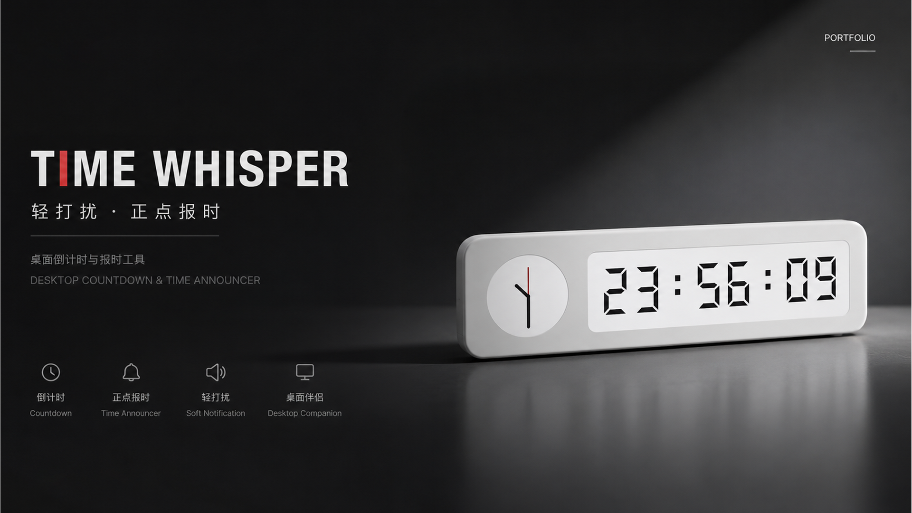
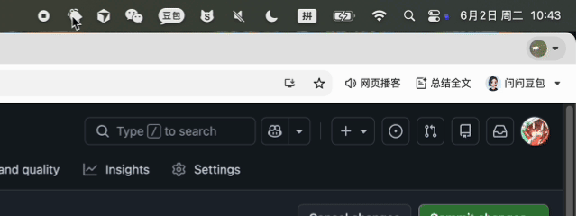
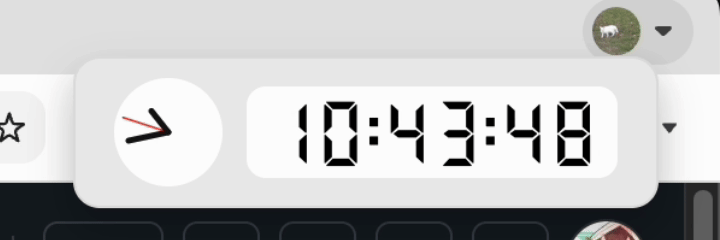
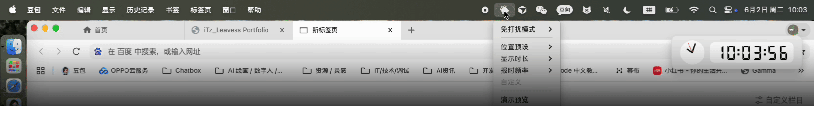

<div align="center">
  <!--  -->
  <h1>Timewhisper / 极简桌面时钟 </h1>
</div>

## 极简桌面时钟 · 一个几乎感觉不到存在的时钟

> 为深度工作而设计：让你知道时间，但不打断你。



## 为什么做这个？

工作时经常遇到两个问题：

- **一投入就忘时间**：错过会议、忘记休息
- **一提醒就被打断**：手机亮屏、桌面悬浮窗太抢眼，心流一下就断了

我需要一个**真的不烦人**的时钟——它得在，但最好像不存在一样。

## 它怎么做到“不烦人”？

### 1. 只在特定时刻出现
不是一直挂在那儿。只在每分钟的某几秒（比如 10–20 秒、40–50 秒）滑出来，告诉你“时间过去一点了”，然后自己消失。



### 2. 两种时间显示，随你习惯
- **指针**：直观感知时间位置
- **数字**：精确到秒，开会前瞄一眼就够了

### 3. 真的不挡你做事
- 鼠标可以直接“穿过”它，点下面的窗口
- 鼠标移上去会变半透明，不碍眼
- 可以随便拖到角落



### 3. 设置在你想要的位置
- 系统托盘内设置在工作区域的四个角落任一位置
- 伴随运动模糊的拖拽动画缓和滑动



## 怎么用？

- 拖到屏幕角落就行，在系统托盘里设置好舒服的报时频率和时长，让它开机启动运行
- 不用管它，到时间它会自己出来刷个存在感
- 悬停可以看精确时间，移开就淡出


## 适合谁？

- 程序员、写作者、设计师……任何需要长时间专注的人
- 开会前不想被闹钟吓一跳，但又怕迟到的人

## 🛠 本地运行与开发

本应用基于 Node.js、Electron 和 React 构建。

**前置依赖：**
- Node.js (推荐 v18+)

### 运行步骤

1. **安装依赖**
   ```bash
   npm install
   ```

2. **启动开发环境 (结合 Vite 实时预览)**
   ```bash
   npm run dev
   ```

3. **构建并运行**
   先构建前端文件，然后可以通过 electron 启动：
   ```bash
   npm run build
   # 然后进入环境用 electron 运行 main.mjs
   ```

## 📦 版本迭代历史

### v1.0.0
- **初始版本发布**: 完善了定点滑入呈现、数字表盘+机械表盘的 UI 双显。
- **彻底的无干扰设计**: 
  - 取消了右键拖拽交互，保留最克制的显示功能。
  - 实现了 `Electron` 层的 `setIgnoreMouseEvents` 全局点击事件穿透穿透。
  - 增加 Hover 透明度降至 `10%` 的视觉避让机制。
- **视效调优**: 调整了表盘 UI 的字间距、冒号位置，整体比例微缩适配了最佳视觉大小。
- **本地化支持**: 清理了冗余配置文件（如 preload.cjs 等），简化了依赖逻辑，确保拉取到本地后能顺畅地被 Electron 运行。
---

### v1.1.0
#### 核心更新内容：
- **系统级原生控制优化**：采用全原生系统托盘菜单，点击系统栏图标即可快速配置，无需打开多余窗口；完美适配 macOS/Windows 原生 UI，实现视觉与系统的自然融合。
- **位置与时长自定义**：支持时钟位置自定义，提供左上、右上、左下、右下四个预设位置一键切换；报时停留时长可选择 10s/20s/30s，满足不同用户使用习惯。
- **智能报时频率新增**：新增报时频率选择，支持每小时整、每两小时整、每30分钟整触发；“自定义频率”功能将在后续版本上线，敬请期待。
#### 底层优化：
- **架构重建**：重构坐标锚点逻辑为中心点定位系统，提升位置切换与滑入动画的精准度和流畅度，适配不同尺寸屏幕。
- **配置记忆**：引入 config.json 持久化存储，保存用户所有偏好设置，应用重启后无需重新配置。

### v1.1.1
- **切换预设位置新增缓动动画**：强化交互体验。

### v1.1.2
- **增加免打扰模式功能**：新增免打扰设置，在设置时间内不主动弹窗提醒。


